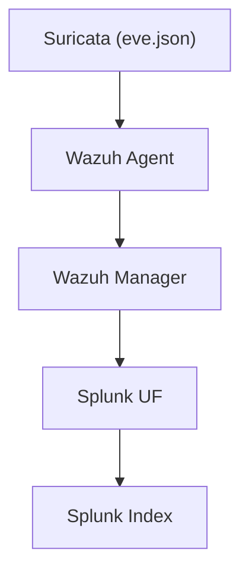

# SIEM Lab Project: Wazuh + Splunk + Suricata on GCP & VirtualBox

> **A hands-on, production-inspired SIEM lab built to simulate real-world security operations using open-source tools and cloud infrastructure.**

[](https://github.com/Aryan-SOC/your-repo/actions)
[](LICENSE)
[](https://www.linkedin.com/in/shewag-bhattarai-103424236)

---

## 📌 Project Overview

This project demonstrates the configuration and integration of a hybrid SIEM environment using:

- **Wazuh** for log aggregation and threat detection  
- **Splunk Enterprise** for data analysis and visualization  
- **Suricata** for network intrusion detection  

Deployed across **Google Cloud Platform (GCP)** and local **VirtualBox VMs**, this lab simulates real attack/defense scenarios using Windows, Linux, and Kali systems.

> **Highlight:**  
> Integration of Wazuh into Splunk enables centralized alert visualization and correlation across all endpoint types — Linux, Windows, and IDS logs.

---

<details>
<summary>⚙️ <strong>Lab Infrastructure</strong> (click to expand)</summary>

### 🖥️ GCP VMs

| VM Name         | Description                                         |
|-----------------|-----------------------------------------------------|
| wazuh-manager   | Ubuntu VM (Dockerized Wazuh + Splunk Universal Forwarder) |
| splunk-server   | Ubuntu VM (Splunk Enterprise)                       |
| target          | Ubuntu VM with Wazuh Agent (general endpoint)       |
| suricata        | Ubuntu VM with Suricata + Wazuh Agent               |

### 🏠 Local/VirtualBox VMs

| VM Name        | Description                                   |
|----------------|-----------------------------------------------|
| windows-target | Windows 10 VM with Wazuh Agent                |
| kali-attacker  | Kali Linux (used to simulate attacks, no agent)|

### 🔐 GCP Firewall Rules

- Allow **TCP 1514** (Wazuh agent-manager communication)
- Allow **TCP 9997** (Splunk data forwarding)
- Allow **SSH (22)**, **Splunk UI (8000)**, **Wazuh UI (5601)**
- Internal VPC access across all instances

</details>

---

<details>
<summary>🧩 <strong>Component Configuration</strong> (click to expand)</summary>

### 🐳 Wazuh Manager (Docker Compose)

- Deployed using [official Wazuh Docker repo](https://github.com/wazuh/wazuh-docker).
- **Fix:** Modified `docker-compose.yml` for wazuh.manager to change volume from:
  ```
  wazuh_logs:/var/ossec/logs
  ```
  to:
  ```
  ./wazuh_manager_logs:/var/ossec/logs
  ```
  _This enabled host-level access to `alerts.json` for Splunk UF._

- Applied changes via:
  ```bash
  docker-compose down && docker-compose up -d
  ```

### 📊 Splunk Enterprise (Indexer + Search Head)

- Installed on `splunk-server` VM
- Configured data receiver on TCP 9997
- Created index: `wazuh-alerts`

### 🔁 Splunk Universal Forwarder (on Wazuh Manager)

**Sample Configs:**

<details>
<summary><strong>inputs.conf</strong></summary>

```ini
[monitor:///home/YOUR_USER/wazuh-docker/single-node/wazuh_manager_logs/alerts/alerts.json]
index = wazuh-alerts
sourcetype = wazuh-alerts
disabled = false
```
</details>

<details>
<summary><strong>props.conf</strong></summary>

```ini
[wazuh-alerts]
INDEXED_EXTRACTIONS = json
```
</details>

<details>
<summary><strong>outputs.conf</strong></summary>

```ini
[tcpout]
defaultGroup = default-autolb-group

[tcpout:default-autolb-group]
server = <SPLUNK_SERVER_IP>:9997
```
</details>

- Verified using Splunk search:
  ```
  index="wazuh-alerts"
  ```

- Wazuh dashboards imported via Splunk Studio (JSON source)

---

### 🛡️ Suricata Configuration (on suricata VM)

- **Interface:** ens4

**Key `suricata.yaml` config:**
```yaml
af-packet:
  - interface: ens4

outputs:
  - eve-log:
      enabled: yes
      filetype: regular
      filename: /var/log/suricata/eve.json
```
- `HOME_NET` configured as: `[10.190.0.0/20]`

- Start/verify:
  ```bash
  sudo systemctl restart suricata
  sudo systemctl status suricata
  ```

- Rule management:
  ```bash
  sudo suricata-update
  ```

### 🤝 Suricata + Wazuh Integration

- Wazuh agent installed on Suricata VM
- `ossec.conf` added:
  ```xml
  <localfile>
    <log_format>json</log_format>
    <location>/var/log/suricata/eve.json</location>
  </localfile>
  ```
- Restarted agent:
  ```bash
  sudo systemctl restart wazuh-agent
  ```
- Verified in Wazuh Dashboard: `rule.groups: suricata`

---

### 🪟 Wazuh Agent on Windows

- Installed Wazuh agent on `windows-target`
- Configured to point to Wazuh manager (internal GCP IP)
- Verified log ingestion in Wazuh + Splunk

</details>

---

<details>
<summary>🧪 <strong>Attack Simulation & Validation</strong> (click to expand)</summary>

#### Using Kali VM to:

- Run Nmap scans
- Trigger brute-force attempts
- Test basic web attacks

#### Confirmed Data Flows:

- **Suricata alerts:** `eve.json` → Wazuh → Splunk
- **Endpoint data:** Wazuh agents → Splunk

#### Log Pipeline Diagram



</details>

---

## ✅ Key Outcomes

- **Log forwarding pipeline:**  
  Suricata (`eve.json`) → Wazuh Agent → Wazuh Manager → Splunk UF → Splunk Index

- **Enterprise SOC simulation:**  
  Modular detection stack, real issues solved (volumes, agent comms, interfaces)

- **Cross-platform:**  
  Linux, Windows, Suricata data, cloud + on-prem

- **Centralized alert visibility:**  
  All Wazuh alerts (Linux, Windows, Suricata) in Splunk

---

## 📎 Assumptions

- Ubuntu/Docker/Splunk/Wazuh pre-installed
- GCP & VirtualBox networking + SSH configured
- **No basic install steps included**

---

## 📚 Resources

- [Wazuh Documentation](https://documentation.wazuh.com/)
- [Splunk Docs](https://docs.splunk.com/)
- [Suricata Docs](https://suricata.readthedocs.io/)
---

## 🙌 Contribute or Connect

Have suggestions, feedback, or want to collaborate on lab setups like this? **Let’s connect and grow together in cybersecurity!**

---

> **Author:** Shewag Bhattarai  
> **LinkedIn:** [www.linkedin.com/in/shewag-bhattarai-103424236](https://www.linkedin.com/in/shewag-bhattarai-103424236)  
> **License:** [MIT](LICENSE)
